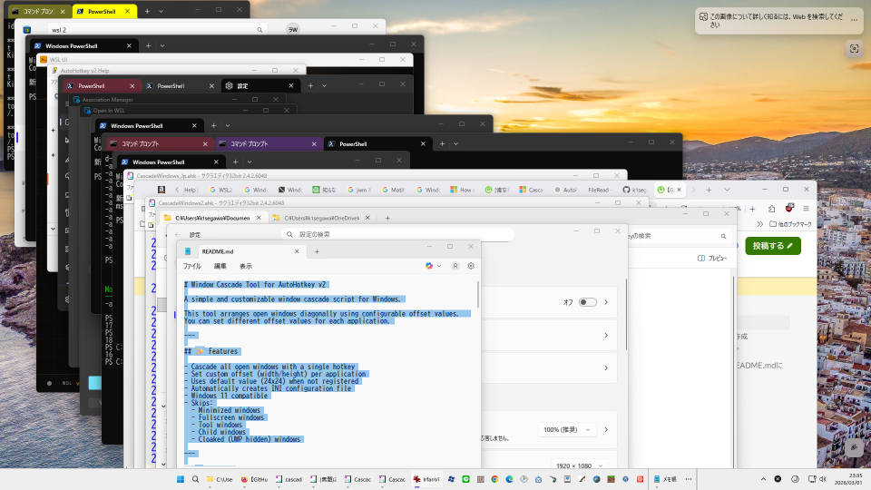
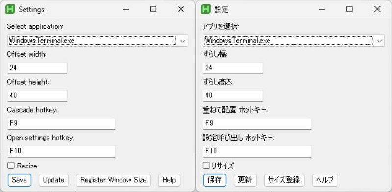

# Window Cascade Tool for AutoHotkey v2

<p align="center">

</p>

A customizable and intelligent window cascade tool for Windows.

A window arranging feature similar to the one available in Windows 10.

This script arranges open windows diagonally using configurable offset values.  
You can define different offsets per application, customize hotkeys, and optionally resize all windows to a registered window size.

---

## ✨ Features

* Cascade all open windows with a single hotkey
* Set custom offset (width / height) per application
* Default offset (24x24) for unregistered applications
* Update settings instantly without closing the GUI
* Register the size of the front window
* Optional: Resize all windows to the registered window size
* Customizable hotkeys for Cascade and Settings GUI
* Force redraw after update (prevents visual glitches)
* Automatically creates INI configuration file
* Windows 10 / 11 compatible
* Automatically skips:

  * Minimized windows
  * Fullscreen windows
  * Tool windows
  * Child windows
  * Cloaked (UWP hidden) windows
  * Snap-related special windows
  * The configuration GUI itself
  * MsgBox windows created by this script

---

## ⌨ Hotkeys

Default hotkeys:

| Key | Function |
| --- | --- |
| F9 | Cascade all windows |
| F10 | Open settings GUI |

Hotkeys can be changed from the settings GUI or in the INI file.

Modifier keys:

* `^` = Ctrl
* `!` = Alt
* `+` = Shift
* `#` = Win

Example:

* `Ctrl+Alt+F9` = `^!F9`

---

## ⚙ Configuration File

The script automatically creates:

```text
cascade_offsets.ini
```

Location:  
Same folder as the script.

---

### Default (Unregistered) Section

If no offset is registered for an application, the script uses:

```ini
[Unregistered]
Width=24
Height=24
```

You may edit this manually if needed.

---

### Application-specific settings

Each application is stored using its executable name.

Example:

```ini
[notepad.exe]
Width=40
Height=40
```

---

### Registered Window Size (Global)

When the **"Register Window Size"** button is pressed,  
the size of the current front window is stored in the INI file.

Example:

```ini
[Unregistered]
SizeW=1280
SizeH=720
```

This registered size is **global and shared by all applications**.

If the option **"Resize"** is enabled,  
all cascaded windows will be resized to this stored size.

If no size has been registered yet, resizing will not occur.

---

### Keybind Section

Hotkeys are stored in the following section:

```ini
[Keybind]
Cascade=F9
Gui=F10
```

Examples with modifier keys:

```ini
[Keybind]
Cascade=^!F1
Gui=#F10
```

---

### Options Section

Additional options are stored in the following section:

```ini
[Options]
Resize=0
```

Values:

* `0` = disabled
* `1` = enabled

---

## 🛠 Requirements

* Windows 10 / Windows 11
* AutoHotkey v2.0+

Download AutoHotkey:  
https://www.autohotkey.com/

---

## 🚀 How to Use

<p align="center">

</p>

1. Install **AutoHotkey v2**
2. Run the script or EXE
3. Open multiple windows
4. Press **F9** to cascade them
5. Press **F10** to open the settings GUI
6. Select an application
7. Set offset values
8. (Optional) Click **Register Window Size**
   to store the size of the front window
9. Enable **Resize** if you want all windows resized
10. (Optional) Change the hotkeys
11. Click **Update** to apply instantly
12. Or click **Save** to store and close

After saving, press the Cascade hotkey anytime to apply the layout.

To exit the tool:  
Right-click the task tray **[H]** icon and choose **Exit**.

---

## 🧠 How It Works

<p align="center">

</p>

* Windows are arranged diagonally using cumulative offset values.
* Offset values are applied per executable name.
* The **Register Window Size** button saves the size of the current front window.
* The stored size is shared globally across all applications.
* If **Resize** is enabled:

  * All windows will be resized to the registered size.

* The configuration GUI is automatically excluded from processing.
* MsgBox windows created by this script are also excluded.
* Update triggers a forced redraw to prevent rendering artifacts.

---

## 📌 Notes

* Modern Windows 11 apps are supported.
* The GUI window is excluded from cascade processing.
* Offset stacking is cumulative (diagonal layout).
* The registered window size is optional and only applied when enabled.
* Hotkeys can be customized safely from the GUI.
* Designed to avoid layout conflicts with special system windows.

Blog:  
https://k1segawa.exblog.jp/245101621/

---

## 📄 License

MIT License

---

# 日本語説明

AutoHotkey v2 で作成されたウインドウカスケードツールです。

Windows 10 にあったウインドウ整列機能のように、  
開いているウインドウを斜めに並べて再配置します。

アプリごとに **ずらす幅と高さ** を設定でき、  
さらに **最前面ウインドウのサイズを登録して全ウインドウを同サイズに揃える** ことも可能です。

ホットキーも変更できます。

---

## ✨ 特徴

* ホットキー1つで再配置
* アプリごとのずらし量設定可能
* 未登録時はデフォルト値 (24x24) を使用
* 更新ボタンで閉じずに即反映
* 最前面ウインドウのサイズを登録するボタン
* リサイズオプションで全ウインドウを登録サイズに揃える
* ホットキー変更可能
* 更新時に強制再描画
* INIファイル自動生成
* Windows 10 / 11対応
* 以下を自動除外:

  * 最小化ウインドウ
  * フルスクリーン
  * ツールウインドウ
  * 子ウインドウ
  * Cloakedウインドウ（UWP内部）
  * スナップ関連の特殊ウインドウ
  * 設定GUI自身
  * このスクリプトのMsgBox

---

## ⌨ ホットキー

初期ホットキー:

| キー | 動作 |
| --- | --- |
| F9 | 全ウインドウ再配置 |
| F10 | 設定GUIを開く |

GUIまたはINIファイルから変更できます。

修飾キー:

* `^` = Ctrl
* `!` = Alt
* `+` = Shift
* `#` = Win

例:

* `Ctrl+Alt+F9` = `^!F9`

---

## ⚙ 設定ファイル

スクリプトと同じフォルダに

```text
cascade_offsets.ini
```

が自動生成されます。

---

### 未登録アプリのデフォルト値

未登録アプリは次の値が使用されます。

```ini
[Unregistered]
Width=24
Height=24
```

必要に応じて手動編集も可能です。

---

### アプリごとの設定

アプリごとに以下のように保存されます。

```ini
[notepad.exe]
Width=40
Height=40
```

---

### 登録サイズ（全体共通）

「**サイズ登録**」ボタンを押すと、  
最前面ウインドウのサイズがINIファイルに保存されます。

```ini
[Unregistered]
SizeW=1280
SizeH=720
```

このサイズは **アプリ別ではなく全体共通サイズ** です。

「**リサイズ**」を有効にすると、  
すべてのウインドウがこのサイズにリサイズされます。

※ サイズが登録されていない場合はリサイズされません。

---

### Keybind セクション

ホットキーは以下のセクションに保存されます。

```ini
[Keybind]
Cascade=F9
Gui=F10
```

修飾キーを使う例:

```ini
[Keybind]
Cascade=^!F1
Gui=#F10
```

---

### Options セクション

追加オプションは以下のセクションに保存されます。

```ini
[Options]
Resize=0
```

値:

* `0` = 無効
* `1` = 有効

---

## 🛠 動作環境

* Windows 10 / Windows 11
* AutoHotkey v2.0+

AutoHotkey ダウンロード先:  
https://www.autohotkey.com/

---

## 🚀 使用方法

1. **AutoHotkey v2** をインストール
2. スクリプトまたはEXEを実行
3. 複数ウインドウを開く
4. **F9** キーでカスケード配置
5. **F10** キーで設定GUIを開く
6. アプリを選択
7. ずらし量を設定
8. （任意）「**サイズ登録**」で最前面ウインドウのサイズを保存
9. 「**リサイズ**」をONにすると全ウインドウを同サイズに変更
10. （任意）ホットキーを変更
11. 「**更新**」で即反映
12. または「**保存**」で保存して閉じる

保存後は、カスケード用ホットキーを押せばいつでも再配置できます。

終了方法:  
タスクトレイの **[H]** アイコンを右クリックして **Exit** を選択します。

---

## 🧠 動作説明

* ウインドウは累積オフセットで左上から斜め下へ並びます。
* オフセット値は exe 名ごとに適用されます。
* 「**サイズ登録**」ボタンは現在の最前面ウインドウのサイズを保存します。
* 保存されたサイズは全アプリ共通で使用されます。
* 「**リサイズ**」が有効な場合:

  * 全ウインドウが登録済みサイズへリサイズされます。

* 設定GUIは自動的に処理対象から除外されます。
* このスクリプトの MsgBox も除外されます。
* 更新時には再描画が行われ、表示崩れを防ぎます。

---

## 📌 備考

* Windows 11 のモダンアプリにも対応しています。
* 設定GUIはカスケード処理から除外されます。
* ずらし量は累積されるため、斜め配置になります。
* 登録サイズは任意機能で、有効時のみ適用されます。
* 特殊なシステムウインドウとの競合を避けるよう設計されています。

Blog:  
https://k1segawa.exblog.jp/245101621/

---

## 📄 ライセンス

MIT License

---

## 📌 Blog

[ChatGPT] ウインドウのカスケード配置 (左上から斜め下へ重なるように) - タイル型や分割でなく [AutoHotKey v2] (3/1) : 体重と今日食べたもの

https://k1segawa.exblog.jp/245101621/
