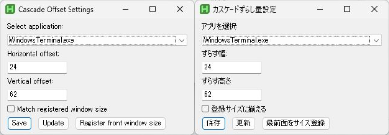
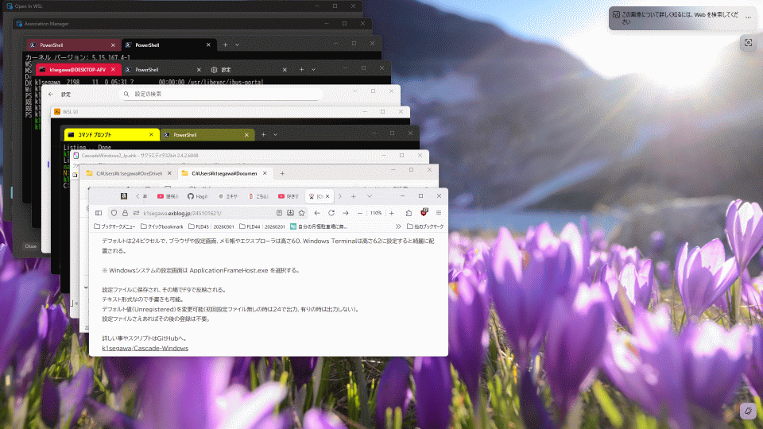

# Window Cascade Tool for AutoHotkey v2
<p align="center">

</p>
A customizable and intelligent window cascade tool for Windows.

A window arranging feature similar to the one available in Windows 10.

This script arranges open windows diagonally using configurable offset values.
You can define different offsets per application and optionally resize all windows to a registered window size.

---

## ✨ Features

* Cascade all open windows with a single hotkey
* Set custom offset (width / height) per application
* Default offset (24x24) for unregistered applications
* Update settings instantly without closing the GUI
* Register the size of the frontmost window
* Optional: Match all windows to the registered window size
* Force redraw after update (prevents visual glitches)
* Automatically creates INI configuration file
* Windows 10 / 11 compatible
* Automatically skips:

  * Minimized windows
  * Fullscreen windows
  * Tool windows
  * Child windows
  * Cloaked (UWP hidden) windows
  * The configuration GUI itself

---

## ⌨ Hotkeys

| Key | Function                      |
| --- | ----------------------------- |
| F9  | Cascade all windows           |
| F10 | Open offset configuration GUI |

---

## ⚙ Configuration File

The script automatically creates:

```
cascade_offsets.ini
```

Location:
Same folder as the script.

---

### Default (Unregistered) Section

If no offset is registered for an application, the script uses:

```
[Unregistered]
Width=24
Height=24
```

You may edit this manually if needed.

---

### Application-specific settings

Each application is stored using its executable name.

Example:

```
[notepad.exe]
Width=40
Height=40
```

---

### Registered Window Size (Global)

When the **"Register Top Window Size"** button is pressed,
the size of the current frontmost window is stored in the INI file.

Example:

```
[Unregistered]
SizeW=1280
SizeH=720
```

This registered size is **global and shared by all applications**.

If the option **"Match registered window size"** is enabled,
all cascaded windows will be resized to this stored size.

If no size has been registered yet, resizing will not occur.

---

## 🛠 Requirements

* Windows 10 / Windows 11
* AutoHotkey v2.0+

Download AutoHotkey:
https://www.autohotkey.com/

---

## 🚀 How to Use
<p align="center">

</p>
1. Install **AutoHotkey v2**
2. Run the script or EXE
3. Open multiple windows
4. Press **F9** to cascade them
5. Press **F10** to open the settings GUI
6. Select an application
7. Set offset values
8. (Optional) Click **Register Top Window Size**
   to store the size of the frontmost window
9. Enable **Match registered window size** if you want all windows resized
10. Click **Update** to apply instantly
    or click **Save** to store and close

After saving, press **F9** anytime to apply the layout.

---

## 🧠 How It Works
<p align="center">

</p>
* Windows are arranged diagonally using cumulative offset values.
* Offset values are applied per executable name.
* The **Register Top Window Size** button saves the size of the current frontmost window.
* The stored size is shared globally across all applications.
* If **Match registered window size** is enabled:

  * All windows will be resized to the registered size.
* The configuration GUI is automatically excluded from processing.
* Update triggers a forced redraw to prevent rendering artifacts.

---

## 📌 Notes

* Modern Windows 11 apps are supported.
* The GUI window is excluded from cascade processing.
* Offset stacking is cumulative (diagonal layout).
* The registered window size is optional and only applied when enabled.
* Designed to avoid layout conflicts with special system windows.

Blog:
https://k1segawa.exblog.jp/245101621/

---

## 📄 License

MIT License

---

# 日本語説明

AutoHotkey v2 で作成されたウインドウカスケードツールです。

Windows 10 にあったウインドウ整列機能のように、
開いているウインドウを斜めに並べて再配置します。

アプリごとに **ずらす幅と高さ** を設定でき、
さらに **最前面ウインドウのサイズを登録して全ウインドウを同サイズに揃える** ことも可能です。

---

## ✨ 特徴

* ホットキー1つで再配置
* アプリごとのずらし量設定可能
* 未登録時はデフォルト値 (24x24) を使用
* 更新ボタンで閉じずに即反映
* 最前面ウインドウのサイズを登録するボタン
* 登録サイズにすべてのウインドウを揃えるオプション
* 更新時に強制再描画
* INIファイル自動生成
* Windows 10 / 11対応
* 以下を自動除外:

  * 最小化ウインドウ
  * フルスクリーン
  * ツールウインドウ
  * 子ウインドウ
  * Cloakedウインドウ（UWP内部）
  * 設定GUI自身

---

## ⌨ ホットキー

| キー  | 動作        |
| --- | --------- |
| F9  | 全ウインドウ再配置 |
| F10 | 設定GUIを開く  |

---

## ⚙ 設定ファイル

スクリプトと同じフォルダに

```
cascade_offsets.ini
```

が自動生成されます。

---

### 未登録アプリのデフォルト値

```
[Unregistered]
Width=24
Height=24
```

未登録アプリはこの値が使用されます。

---

### アプリごとの設定

アプリごとに以下のように保存されます。

```
[notepad.exe]
Width=40
Height=40
```

---

### 登録サイズ（全体共通）

「最前面をサイズ登録」ボタンを押すと、
最前面ウインドウのサイズが保存されます。

```
[Unregistered]
SizeW=1280
SizeH=720
```

このサイズは **アプリ別ではなく全体共通サイズ** です。

「登録サイズに揃える」を有効にすると、
すべてのウインドウがこのサイズにリサイズされます。

※ サイズが登録されていない場合はリサイズは行われません。

---

## 🚀 使用方法

1. AutoHotkey v2 をインストール
2. スクリプトまたはEXEを実行
3. 複数ウインドウを開く
4. **F9キー** でカスケード配置
5. **F10キー** で設定GUIを開く
6. アプリを選択
7. ずらし量を設定
8. （任意）「最前面をサイズ登録」でサイズ保存
9. 「登録サイズに揃える」をONにすると全ウインドウ同サイズ
10. 「更新」で即反映、「保存」で保存して閉じる

---

## 📄 ライセンス

MIT License

---

## 📌 Blog

[ChatGPT] ウインドウのカスケード配置 (左上から斜め下へ重なるように) - タイル型や分割でなく [AutoHotKey v2] (3/1) : 体重と今日食べたもの

https://k1segawa.exblog.jp/245101621/
